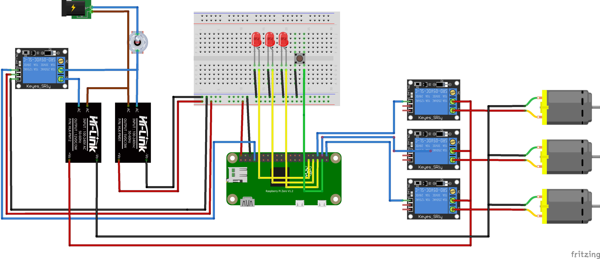

# Gardnero
Application for automatic watering of plants on a RaspberryPi


<p align="left">
  
</p>


## Development Instructions

### OpenAPI
Modify the contents of `resources/schema.yaml` accordingly. Afterwards re-generate the Flask server code by running:
```
./cmd_generate_openapi.sh
```
New endpoints must be added in `controller.py`. Dummy endpoint functions are found at `openapi/openapi_server/controllers/default_controller.py` after re-generating the server code.

### Install requirements
```
pip3 install -r openapi/requirements.txt 
pip3 install -r resources/requirements.txt
```
## Add comand to boot
```commandline
crontab -e
@reboot python3 /home/pi/Gardnero/main.py

```