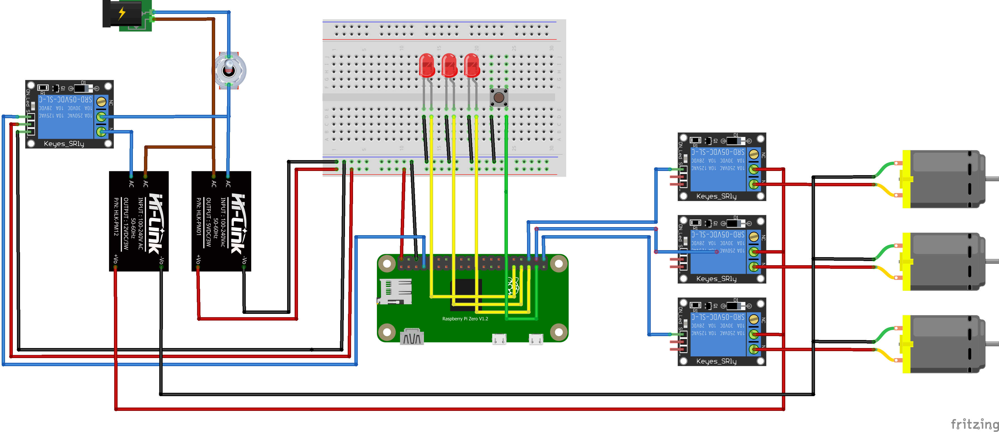

# Gardnero
Application for automatic watering of plants on a RaspberryPi
<p align="left">
  
</p>


## Setup 
Install dependencies
``` 
pip3 install -r resources/requirements.txt
```
Start the service:
```
./start.sh
```

## Execute command at boot
Open the crontab jobs:
```
crontab -e
```
Add the line:
```
@reboot /home/pi/Gardnero/start.sh 2>&1 | /usr/bin/logger -t CRONOUTPUT
```
Afterwards, to inspect logs:
```
cat /var/log/syslog | grep CRONOUTPUT
```

## Electrical Wiring
Make sure the electrical wiring of the RaspberryPi ports is well defined at `resources/gpio_map.yaml`.